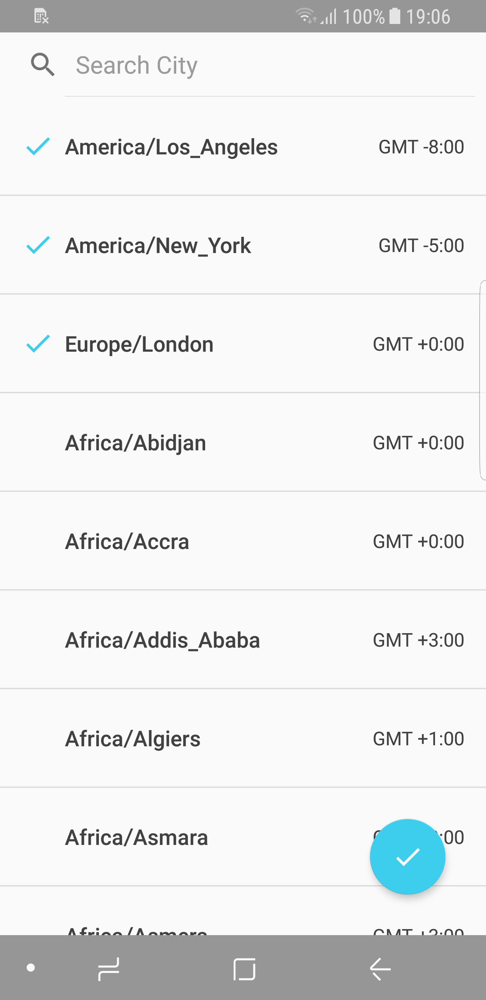

# SimpleClock

**SimpleClock** is my sample App demonstrating usage of AndroidX JetPack components.

Product design full credit to Andrii Kotliarenko
(https://www.uplabs.com/posts/modern-clock-redesign-concept)

 
&nbsp;
 
&nbsp;
 
&nbsp;

## License
MIT © [lcgforever](https://github.com/lcgforever)